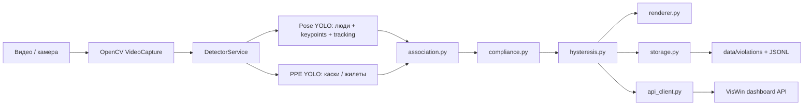

# Detect-AI-PPE

Система мониторинга средств индивидуальной защиты (СИЗ) на видео. Проект состоит из Python-пайплайна компьютерного зрения и готовой Windows-сборки дашборда. Нейросеть находит людей, каски и жилеты, связывает найденные СИЗ с конкретными людьми, стабилизирует решение по времени и фиксирует нарушения.

Основные классы нарушений:

- `helmet` — отсутствует каска.
- `vest` — отсутствует сигнальный жилет.
- `helmet_vest` — отсутствуют оба обязательных элемента.

## Состав проекта

```text
Detect-AI-PPE/
├── README.md
├── VisWin/
│   ├── VisDash.exe
│   ├── VisDash.dll
│   ├── VisData.db
│   ├── appsettings.json
│   ├── web.config
│   └── wwwroot/
└── ppe_monitor/
    ├── main.py
    ├── requirements.txt
    ├── ppe_test.py
    ├── config/
    │   └── settings.py
    ├── models_weights/
    │   ├── best.pt
    │   ├── best.engine
    │   ├── best.onnx
    │   ├── best.fp16.onnx
    │   └── yolov8n-pose.pt
    ├── src/
    │   ├── core/
    │   │   ├── association.py
    │   │   ├── compliance.py
    │   │   ├── hysteresis.py
    │   │   └── models.py
    │   ├── services/
    │   │   ├── api_client.py
    │   │   ├── detector.py
    │   │   ├── projector.py
    │   │   └── storage.py
    │   ├── ui/
    │   │   └── renderer.py
    │   └── utils/
    │       ├── hardware.py
    │       └── test_hardware.py
    ├── test/
    └── data/
        ├── logs/
        └── violations/
```

Служебные папки с результатами прогонов, архивы, логи и кеши Python не относятся к основной архитектуре приложения.

## Архитектура

Пайплайн обработки находится в `ppe_monitor/main.py`.



### Детекция

`src/services/detector.py` загружает две модели Ultralytics YOLO:

- `POSE_MODEL` — pose-модель для людей, трекинга и keypoints. По умолчанию `models_weights/yolov8n-pose.pt`.
- `PPE_MODEL` — модель СИЗ для касок, жилетов и других классов PPE.

Для людей используется `YOLO.track(..., persist=True)`, поэтому каждому человеку назначается `track_id`. Для СИЗ используется обычный инференс `YOLO(...)`.

### Привязка СИЗ к людям

`src/core/association.py` связывает объекты PPE с конкретным человеком. Алгоритм не ограничивается простым пересечением боксов:

- проверяет центр СИЗ относительно бокса человека;
- использует зоны тела: каска должна быть в зоне головы, жилет — в зоне торса;
- проверяет расстояние между центрами;
- применяет ограничения размеров PPE относительно человека;
- использует keypoints головы и торса;
- применяет IoU как дополнительное подтверждение.

Итогом является список `Person`, где у каждого человека заполнен `assigned_ppe`.

### Проверка нарушений

`src/core/compliance.py` сравнивает найденные у человека СИЗ с обязательным набором:

```python
REQUIRED_PPE_CLASSES = {"helmet", "vest"}
```

Если у человека не хватает одного или нескольких элементов, создаётся объект `Violation`.

### Стабилизация событий

`src/core/hysteresis.py` уменьшает ложные срабатывания. Нарушение считается подтверждённым не по одному кадру, а по окну наблюдений:

- `HYSTERESIS_WINDOW_FRAMES = 30`
- вход в нарушение: `HYSTERESIS_ENTER_THRESH = 0.7`
- выход из нарушения: `HYSTERESIS_EXIT_THRESH = 0.5`

Так система не отправляет событие каждый раз, когда детекция на одном кадре пропала или появилась.

### Сохранение и API

`src/services/storage.py` асинхронно сохраняет:

- кадры нарушений в `ppe_monitor/data/violations/`;
- JSONL-журнал в `ppe_monitor/data/logs/violations.jsonl`.

`src/services/api_client.py` асинхронно отправляет инциденты в дашборд REST-запросом. По умолчанию URL задан в `config/settings.py`:

```python
API_INCIDENT_URL = "https://localhost:7136/api/metrics/send-incident"
```

Если дашборд не запущен, обработка видео продолжается, но в логах будут ошибки подключения к `localhost:7136`.

## Требования

Минимально:

- Windows 10/11 или Linux.
- Python 3.11.
- 8 GB RAM или больше.
- OpenCV-compatible video input: файл, RTSP/HTTP-поток или индекс камеры.

Рекомендуется:

- NVIDIA GPU.
- CUDA-версия PyTorch, если требуется ускорение на GPU.
- TensorRT, если используется `best.engine`.

Проверка установленного Python:

```powershell
py -0p
py -3.11 --version
```

## Установка Python-зависимостей

Все команды выполняются из корня проекта.

```powershell
cd D:\Detect-AI-PPE\ppe_monitor
$env:PYTHONUTF8 = "1"
py -3.11 -m pip install -r requirements.txt
```

Если нужен GPU-режим на NVIDIA, установите CUDA-сборку PyTorch, совместимую с вашим драйвером. Например для CUDA 12.8:

```powershell
py -3.11 -m pip install --force-reinstall torch==2.7.0+cu128 torchvision==0.22.0+cu128 --index-url https://download.pytorch.org/whl/cu128
```

Проверка GPU:

```powershell
py -3.11 -c "import torch; print(torch.__version__); print(torch.cuda.is_available()); print(torch.cuda.get_device_name(0) if torch.cuda.is_available() else 'no cuda')"
```

## Модели

Модели лежат в `ppe_monitor/models_weights/`.

Текущий набор в рабочей копии:

```text
best.pt
best.engine
best.onnx
best.fp16.onnx
yolov8n-pose.pt
```

Назначение:

- `yolov8n-pose.pt` — модель позы человека для поиска людей, keypoints и трекинга.
- `best.pt` — исходная обученная PPE-модель.
- `best.engine` — TensorRT FP16-версия `best.pt`, собранная под конкретный GPU/драйвер/TensorRT.
- `best.onnx`, `best.fp16.onnx` — промежуточные ONNX-артефакты.

Важно: TensorRT `.engine` привязан к окружению, на котором он был собран. Такой файл обычно не переносится надёжно между разными GPU, версиями драйвера и TensorRT.

### Настройка PPE_MODEL

`config/settings.py` берёт `PPE_MODEL` из авто-профиля `src/utils/hardware.py`. В исходной логике `hardware.py` ожидает файлы:

```text
models_weights/PPE_M_YOLO_1280.onnx
models_weights/PPE_M_YOLO_960.onnx
models_weights/PPE_M_YOLO_640.onnx
```

Если в `models_weights/` используются текущие `best.*` файлы, укажите актуальную модель вручную. Для TensorRT `best.engine` рекомендуется:

```python
PPE_MODEL = "models_weights/best.engine"
IMG_SIZE = 768
HALF_PRECISION = False
```

`HALF_PRECISION = False` здесь не отключает FP16 внутри TensorRT engine. Оно только убирает передачу устаревающего параметра `half=True` в Ultralytics во время инференса.

### Конвертация best.pt в TensorRT

При наличии NVIDIA GPU, CUDA-сборки PyTorch и TensorRT:

```powershell
cd D:\Detect-AI-PPE\ppe_monitor
$env:PYTHONUTF8 = "1"
py -3.11 -c "from ultralytics import YOLO; YOLO(r'models_weights\best.pt').export(format='engine', device=0, half=True)"
```

Результат сохраняется рядом:

```text
models_weights/best.engine
```

## Запуск дашборда

Windows-сборка дашборда находится в `VisWin/`.

В отдельном терминале:

```powershell
cd D:\Detect-AI-PPE\VisWin
.\VisDash.exe
```

Дашборд хранит локальные данные в `VisWin/VisData.db` и использует статические ресурсы из `VisWin/wwwroot/`. Адреса, на которых он слушает, смотрите в консольном выводе `VisDash.exe`. Python-клиент по умолчанию отправляет инциденты на:

```text
https://localhost:7136/api/metrics/send-incident
```

Если порт или протокол отличаются, измените `API_INCIDENT_URL` в `ppe_monitor/config/settings.py`.

## Запуск нейросети

В другом терминале:

```powershell
cd D:\Detect-AI-PPE\ppe_monitor
$env:PYTHONUTF8 = "1"
py -3.11 main.py --source test\shield_test1.webm
```

Запуск без окна OpenCV:

```powershell
py -3.11 main.py --source test\shield_test1.webm --no-display
```

Запуск с подробными логами:

```powershell
py -3.11 main.py --source test\shield_test1.webm --verbose
```

Запуск с веб-камеры:

```powershell
py -3.11 main.py --source 0
```

Запуск с изменением ширины кадра перед обработкой:

```powershell
py -3.11 main.py --source test\shield_test1.webm --resize 1280
```

## Аргументы main.py

```text
--source      Источник видео: путь к файлу или индекс камеры. По умолчанию 0.
--verbose     Подробное логирование.
--no-display  Не показывать окно OpenCV.
--resize      Изменить ширину кадра с сохранением пропорций.
```

## Результаты работы

Во время работы создаются:

```text
ppe_monitor/ppe_monitor.log
ppe_monitor/data/logs/violations.jsonl
ppe_monitor/data/violations/*.jpg
```

`violations.jsonl` содержит по одной JSON-записи на событие. В записи есть:

- timestamp;
- camera_id;
- track_id;
- violation_type;
- person_box;
- confidence;
- frame_path;
- present_classes;
- frame_number;
- video_offset_ms для видеофайлов.

Кадры нарушений сохраняются в `data/violations/`. Если дашборд доступен, те же события отправляются через API.

## Автонастройка под железо

`src/utils/hardware.py` определяет CPU, RAM и GPU, затем выбирает профиль:

```text
high    GPU >= 6 GB VRAM, CPU >= 6 cores, RAM >= 16 GB
medium  GPU >= 4 GB VRAM или достаточно сильный CPU
low     CPU-only / слабое железо
```

Профиль задаёт:

- `device`: `cuda` или `cpu`;
- `half`: FP16 для GPU;
- `imgsz`: размер входа модели;
- `skip_frames`: частоту обработки кадров;
- `torch_threads`: число потоков PyTorch;
- `PPE_MODEL`: путь к модели СИЗ.

Диагностика профиля:

```powershell
cd D:\Detect-AI-PPE\ppe_monitor\src\utils
py -3.11 test_hardware.py
```

## Калибровка 2D-проекции

`src/services/projector.py` умеет переводить координаты человека на изображении в координаты пола в метрах через гомографию. Для включения нужно задать в `config/settings.py`:

```python
CALIB_IMAGE_PTS = [[x1, y1], [x2, y2], [x3, y3], [x4, y4]]
CALIB_WORLD_PTS = [[X1, Z1], [X2, Z2], [X3, Z3], [X4, Z4]]
```

Требуется ровно 4 пары точек. Если точки не заданы, проекция отключена и основной пайплайн работает без неё.

## API-интеграция

Python-клиент отправляет multipart-запрос:

- файл изображения в поле `image`;
- JSON инцидента в поле `incident`.

Формат JSON:

```json
{
  "CamId": 1,
  "RoomId": 425267,
  "Type": 0,
  "Priority": 1
}
```

Настройки находятся в `ppe_monitor/config/settings.py`:

```python
API_INCIDENT_URL = "https://localhost:7136/api/metrics/send-incident"
API_ROOM_ID = 425267
API_PRIORITY = 1
API_SSL_VERIFY = False
CAMERA_ID = "cam_entrance"
```

`CAMERA_ID` может быть строкой вроде `cam_25`: API-клиент извлечёт из неё числовой ID камеры.

## Вспомогательные инструменты

`ppe_monitor/ppe_test.py` — скрипт для сохранения детекций модели в YOLO-формате. Он проходит по видео, фильтрует классы `helmet`, `human`, `vest` и пишет `.txt`-разметку в папку `auto_labels_yolo/`.

Перед использованием проверьте в файле:

```python
MODEL_PATH = "models_weights/PPE_M_YOLO.pt"
VIDEO_SOURCE = "test/testOne.mp4"
TARGET_CLASSES = {2, 3, 4}
```

Эти пути и ID классов должны соответствовать вашей модели и видео.

## Частые проблемы

### pip падает на UnicodeDecodeError

В PowerShell перед установкой включите UTF-8:

```powershell
$env:PYTHONUTF8 = "1"
py -3.11 -m pip install -r requirements.txt
```

### torch.cuda.is_available() возвращает False

Проверьте драйвер:

```powershell
nvidia-smi
```

Проверьте PyTorch:

```powershell
py -3.11 -c "import torch; print(torch.__version__); print(torch.version.cuda); print(torch.cuda.is_available())"
```

Если установлена CPU-сборка PyTorch, поставьте CUDA-сборку, подходящую вашему драйверу.

### FileNotFoundError для PPE_M_YOLO_*.onnx

`hardware.py` указывает на старые ONNX-файлы. Если их нет, измените `PPE_MODEL` на существующий файл, например:

```python
PPE_MODEL = "models_weights/best.engine"
IMG_SIZE = 768
```

### Ошибка подключения к localhost:7136

Дашборд не запущен или слушает другой адрес. Запустите:

```powershell
cd D:\Detect-AI-PPE\VisWin
.\VisDash.exe
```

Либо измените `API_INCIDENT_URL` в `config/settings.py`.

### Окно OpenCV не открывается

Для серверного режима используйте:

```powershell
py -3.11 main.py --source test\shield_test1.webm --no-display
```

Убедитесь, что установлен `opencv-python`, а не `opencv-python-headless`, если нужен GUI-показ.

## Рекомендуемый порядок работы

1. Установить Python 3.11.
2. Установить зависимости из `ppe_monitor/requirements.txt`.
3. Проверить CUDA, если используется GPU.
4. Проверить наличие файлов моделей в `ppe_monitor/models_weights/`.
5. Настроить `PPE_MODEL` и `IMG_SIZE` в `config/settings.py` под текущую модель.
6. Запустить `VisWin/VisDash.exe` в отдельном терминале.
7. Запустить `ppe_monitor/main.py` на тестовом видео или камере.
8. Проверить `data/violations/`, `data/logs/violations.jsonl` и дашборд.

## Лицензии и зависимости

Проект использует:

- Ultralytics YOLO;
- PyTorch;
- OpenCV;
- ONNX / ONNX Runtime;
- ASP.NET Core для Windows-дашборда.

Лицензии сторонних библиотек определяются их авторами и пакетами.